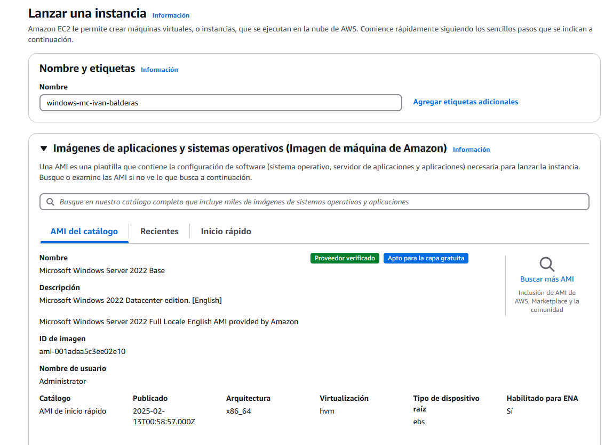
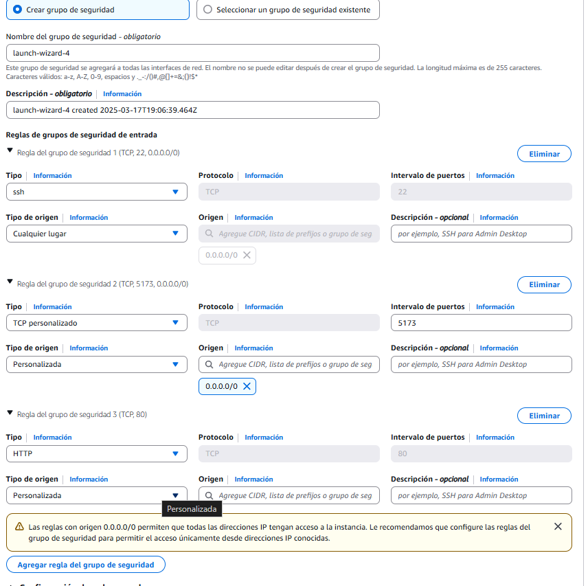
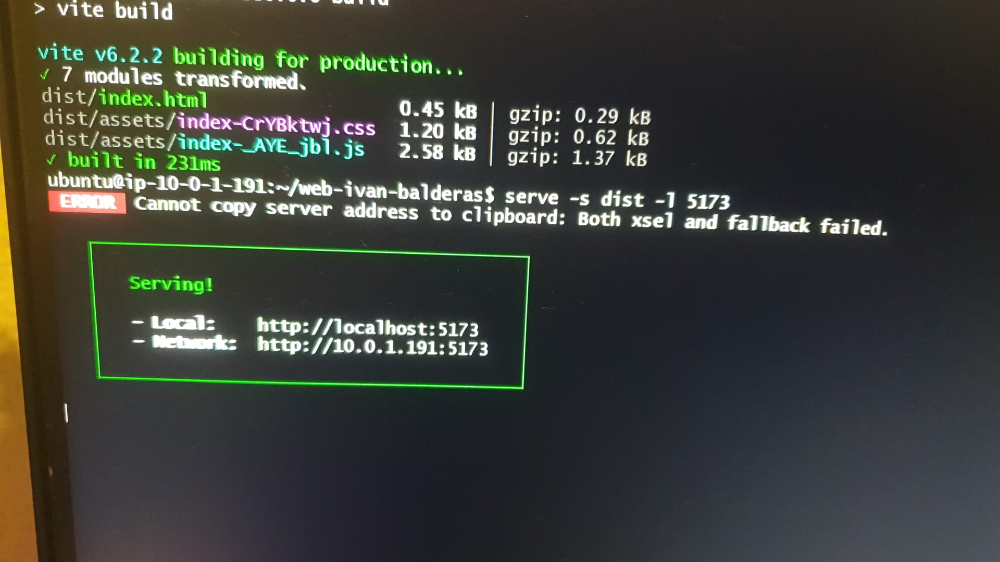
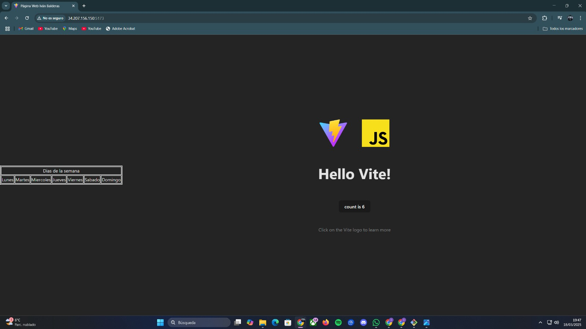

# Paso 1: Crear una VPC.
1. Configurar la VPC y crearla.
   

2. Crear dos subredes.
   1. Subred linux:
      
      
    2. Subred Windows:
      
3. Crear una Internet Gateway asociada a la VPC.
   1. Crear la Gateway:
      
   
   2. Asignar la VPC a la Gateway:
      

4. Añade una regla en la tabla de rutas (0.0.0.0/0) hacia la Gateway.
      1. Crear tabla de enrutamiento
         
         
      2. Añadir una regla en la tabla de rutas (0.0.0.0/0) hacia la Gateway:
         

# Paso 2: Crear una instancia EC2.
1. Instancia EC2 Windows:
   1. Nombre y sistema (Windows Server 2022).
      

   2. Tipo de instancia (t3.medium) y par de claves.
      

   3. Grupo de seguridad Entrante.
      

3. Instancia EC2 Linux:
   1. Nombre y sistema (Ubuntu 22.04).
      

   2. Tipo de instancia y par de claves.
      

   3. Grupo de seguridad Entrante.
      

# Instalación y despliegue web
1. Linux:
   1. Comando 
   ~~~
   sudo apt update
   ~~~
   

   2. Comando
   ~~~
   sudo apt install nodejs npm -y
   ~~~
   

   3. Comando
   ~~~
   sudo npm install -g vite serve
   ~~~
   

   4. Comando
   ~~~
   mkdir web-ivan-balderas && cd web-ivan-balderas
   ~~~
   

   5. Comando
   ~~~
   npm init vite@latest .
   ~~~
   

   6. Comando
   ~~~
   npm install
   ~~~
   

   7. Comando
   ~~~
   npm run build
   ~~~
   

   8. Comando
   ~~~
   serve -s dist -l 5173
   ~~~
   

   9. Foto de la página web
   

# Security Groups
1. Linux
   1. Entrada:
      

   2. Salida:

      

2. Windows
   1. Entrada:
      

   2. Salida:
      

# Pull Request

   1. He realizado el Pull Request con Álvaro, le he modificado el index.html.
   

   2. He enviado el Pull Request con los detalles y cambios en la descripción de este Pull Request.
   